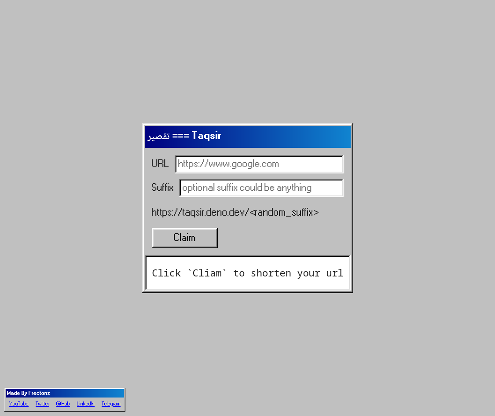

# Taqsir Client

Client web app for [taqsir](https://github.com/frectonz/taqsir).

## [Live Preview](https://taqsir.netlify.app/)

## Technologies

- [Elm](https://elm-lang.org/)
- [Parcel](https://parceljs.org/)
- [98.css](https://jdan.github.io/98.css/)

## Screenshot

